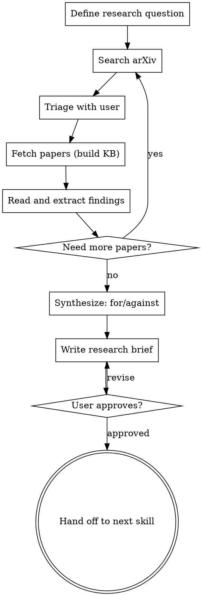

# Research-Driven Development

Build academic grounding before writing code. Search arXiv, fetch relevant papers, synthesize findings, and produce a research brief — so implementation decisions are backed by evidence, not guesses.

<HARD-GATE>
Do NOT write any implementation code until you have built a knowledge base, synthesized findings, and the user has approved the research brief. Even if the user says "just build it" — ask what research question they're trying to answer first.
</HARD-GATE>

## When to Use This

- Building something inspired by a paper ("implement RAG like in this paper")
- Choosing between approaches ("should we use LoRA or full fine-tuning?")
- Validating an idea ("is there research supporting this approach?")
- Understanding state of the art ("what's the latest on mixture of experts?")
- Any task where the user mentions a paper, arXiv ID, or academic concept

## Checklist

You MUST create a task for each of these items and complete them in order:

1. **Define the research question** — what are we trying to learn or validate?
2. **Search for papers** — use paper7 to find relevant work
3. **Triage results** — pick the most relevant papers with the user
4. **Build knowledge base** — fetch papers and read them
5. **Synthesize findings** — extract evidence for and against
6. **Write research brief** — save findings and get user approval
7. **Transition** — hand off to brainstorming or implementation with context

## Process Flow



## The Process

### 1. Define the Research Question

Before searching, pin down what you're trying to learn. Ask the user:

- "What problem are you trying to solve?"
- "What decision are you trying to make?"
- "What would change your approach if the research said X vs Y?"

Good research questions:
- "Is sparse sampling better than full-context for long documents?" (testable)
- "What's the state of the art for code generation with LLMs?" (survey)
- "Does LoRA match full fine-tuning for domain adaptation?" (comparison)

Bad research questions:
- "Tell me about transformers" (too broad)
- "Find papers" (no direction)

### 2. Search for Papers

Use paper7 to search arXiv. Cast a wide net first, then narrow:

```bash
# Broad search
paper7 search "retrieval augmented generation" --max 10

# Narrower
paper7 search "RAG long context faithfulness" --max 5

# By date for recent work
paper7 search "mixture of experts scaling" --max 5 --sort date
```

Present results to the user in a table and ask which to fetch.

### 3. Triage with User

Show search results and recommend which papers to read based on:
- **Relevance** to the research question
- **Recency** — prefer recent work unless looking for foundational papers
- **Citation count** (if known) — landmark papers are worth reading
- **Diversity** — include papers that might contradict the thesis

Ask: "Which of these should I fetch and read? I recommend [X, Y, Z] because..."

### 4. Build Knowledge Base

Fetch selected papers in parallel:

```bash
paper7 get 2401.04088 > /tmp/kb_paper1.md
paper7 get 2307.03172 > /tmp/kb_paper2.md
paper7 get 2410.05970 > /tmp/kb_paper3.md
```

For each paper, read it fully and extract:
- **Key findings** relevant to the research question
- **Specific numbers** — benchmarks, percentages, metrics
- **Methodology** — how did they test this?
- **Limitations** — what did they NOT test?
- **Quotes** worth citing

### 5. Synthesize Findings

After reading all papers, structure the synthesis as:

**Evidence FOR the approach:**
- What papers support it? With what data?

**Evidence AGAINST the approach:**
- What papers contradict it? What caveats exist?

**Gaps in the literature:**
- What hasn't been tested? Where is the research thin?

**Consensus view:**
- What do most papers agree on?

Be honest. If the research doesn't support the user's idea, say so clearly.

### 6. Write Research Brief

Save the synthesis to `docs/research/YYYY-MM-DD-<topic>.md`:

```markdown
# Research Brief: <Topic>

## Question
<What we were trying to learn>

## Papers Reviewed
- [Paper Title](https://arxiv.org/abs/XXXX.XXXXX) — one-line summary
- ...

## Findings
<Structured synthesis>

## Recommendation
<What the research suggests we should do>

## Implications for Implementation
<How this should shape the design>
```

Commit the brief to git.

### 7. Hand Off

Once the user approves the brief:
- If implementation is next → invoke brainstorming or writing-plans with the research context
- If more research is needed → loop back to step 2
- If the research killed the idea → tell the user honestly and suggest alternatives

## Key Principles

- **Evidence over opinion** — cite specific papers and numbers, not vibes
- **Steel-man the counterargument** — actively look for papers that disagree
- **Recency matters** — a 2024 paper may invalidate a 2022 finding
- **Quantity isn't quality** — 3 highly relevant papers beat 10 tangential ones
- **The brief is the deliverable** — not the papers themselves, but the synthesis
- **Be honest** — if the research says "don't do this", say that

## Anti-Patterns

| Pattern | Problem |
|---------|---------|
| "I found a paper that agrees" | Confirmation bias — also find papers that disagree |
| Fetching 20 papers | Too many to read properly — pick 3-5 best |
| Skipping the question | Searching without knowing what you're looking for |
| Summarizing without synthesizing | Listing what each paper says vs. answering the question |
| "The research is inconclusive" | Usually means you haven't read carefully enough — dig deeper |
